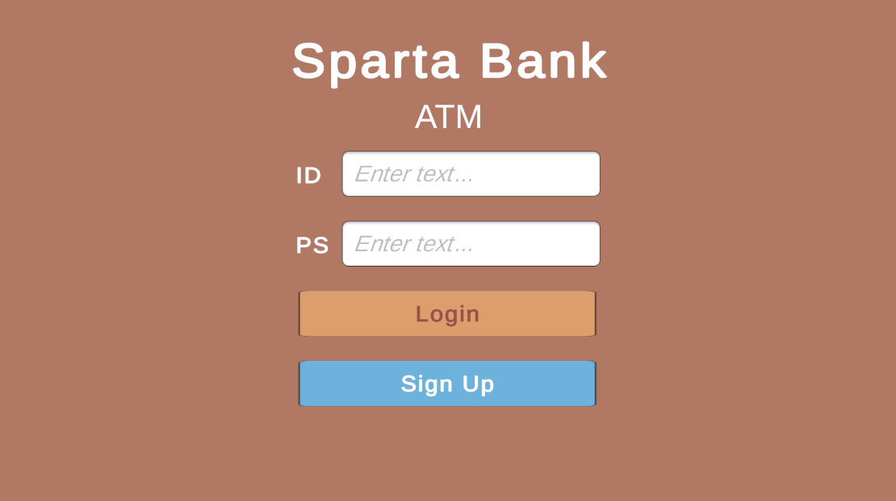

# ATM 시뮬레이터 프로젝트 (Unity)

## 📌 개요  

본 프로젝트는 Unity 환경에서 제작한 ATM 기능 시뮬레이터로,  
제출용 프로젝트로 기획 및 제작되었습니다.  
JSON 파일을 활용해 사용자 데이터를 저장/불러오기하며, 실제 은행 ATM과 유사한 기능을 구현하는 것을 목표로 하였습니다.

---

## 🛠️ 주요 기능

### 🔐 로그인 및 회원가입 시스템
- JSON 기반 `UserData` 관리
- 신규 사용자 회원가입 시 JSON에 정보 저장
- 로그인 시 입력한 정보와 JSON 데이터 대조를 통해 인증

### 💰 계좌 기능
- 현금 및 저축 자산 관리
- 실시간 UI 업데이트로 잔액 확인 가능

### 🏦 입금 / 출금 시스템
- 현금 → 저축 : 입금  
- 저축 → 현금 : 출금  
- 자연수만 입력 가능하도록 TMP 입력 필드 세팅

### 💸 송금 기능
- 다른 사용자에게 금액을 송금하는 기능  
- 대상 사용자가 JSON에 존재하는지 확인 후 송금 처리

---

## 🧠 사용 기술 및 특징

- Unity UI 시스템 (Canvas, Button, TMP InputField 등)
- 정규표현식(RegEx) 기반의 입력 제한 (`^[0-9]+$`)
- `GameManager.Instance` 구조를 활용한 실시간 데이터 참조
- JSON 파일 기반 로컬 데이터 저장/불러오기

---

## 📝 기타

- 이 프로젝트는 Unity 개발 학습을 위한 목적으로 제작되었습니다.
